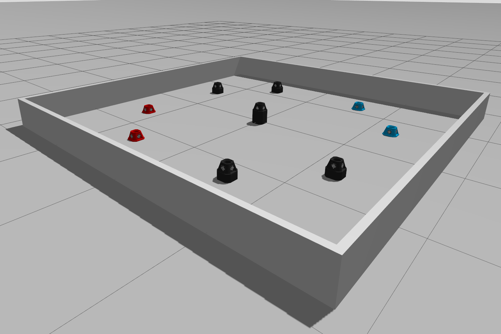

# override_v5
Gazebo Sim Harmonic + ROS 2 Jazzy version of the 2026-27 VEX Robotics Competition game "Override"

## Launching the world:
```bash
ros2 launch override_v5 world_select.launch.py world:=override
```

#### The World


## Resources
- [Apriltag texture generation](https://github.com/rickarmstrong/gazebo_apriltag)
- [GPS field strip texture](https://github.com/kmhswimgirl/field_gps_files)
- [Field CAD](https://cad.onshape.com/documents/39123d895e0333d3724f3e0c/w/57e1564c649f48d1cb42be4c/e/118d92575a58a5edd623f53d)
